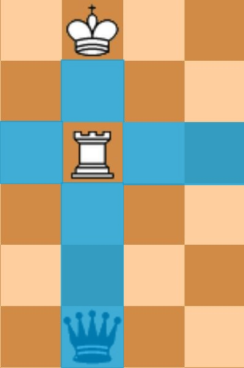
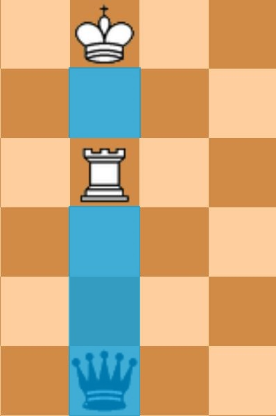
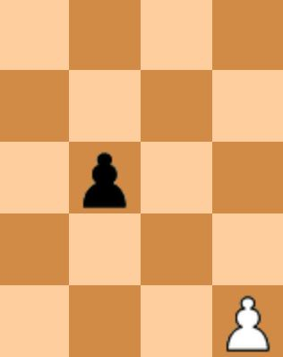
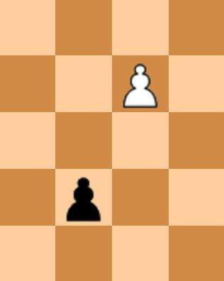
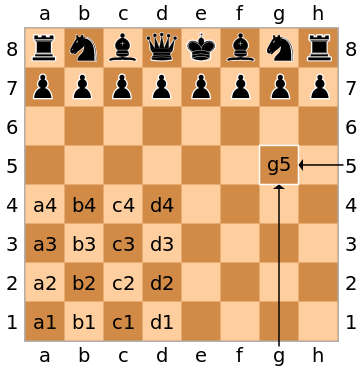

# Chess Game Checkmate Problem

You should solve several kind of problem, for given chess board.

## About Chess rules & terminology

- Check : The state that player's king can be attacked by opponents chess piece.
- Chess piece's movement rule : <https://en.wikipedia.org/wiki/Rules_of_chess#Basic_moves>
- Possible move : The move only thinking of the chess piece's rule (this term is only used on this project).
- Legal move : Possible move which **does not make its own king in check**.
- Checkmate : The state that player's king is **in check** and have **no legal move**.
- Stalemate : The state that player's king is **not in check** and have **no legal move**.
- When playing a **chess game**
  - Skipping(not moving) is illegal
  - **Move that make my king in check is illegal** (only legal move)
  - On checkmate or stalemate, the **game ends**.

### example: move of white rook
  
| possible moves  | legal moves  |
|---|---|
|  |  |

## About special rules & project-specific rules

### Special rules

- **There is no special rule.**
  - No promotion of pawn
  - No castling
  - No en passant(앙파상)

### Project-specific rules

- There can be more chess pieces than the standard game.
  - e.g. 15 white rooks at one board
- However, the number of king will always be 0 or 1.
  - On problem number 0 and 1, each color have up to 1 king.
  - On problem number 2, 3, 4 each color will always have 1 king
  - The board size can be variant. **( 4<= N, M <= 26 )**
- Black pawn(p) can only go down, White pawn(P) can only go up.
- When you move pawns for the first time, you can move 2 tile at once.
  - You can decide with the relative distance of row from top/bottom
    - If black pawn is on second row from top, or white pawn is on second row from bottom, it can go 2 tiles.
  - pawns can move 2 tiles
    - 
  - pawns cannot move 2 tiles
    -  

## Compile and execute

- You can compile multiple files with

```[bash]
# Execute it inside /src
g++ -g  *.cpp -std=c++14 -o chess
```

- Also you can execute it with

```[bash]
./chess
```

## Input file specification

- 3 lines + chess board

```[text]
- problem_id: 0 ~ 4
- problem_specification: other specification (e.g. white/black, piece position)
- N M : board size. N = height, M = width  
- board: N X M board with pieces
```

## Board input specification

- **UPPER CASE: white**
- **lower case: black**
- p, P: **p**awn
- r, R: **r**ook
- n, N: k**n**ight
- b, B: **b**ishop
- q, Q: **q**ueen
- k, K: **k**ing
- . : empty tile

## Board example

```[text]
rnbqkbnr
pppppppp
........
........
........
........
PPPPPPPP
RNBQKBNR
```

## Problem_id Specification

```[text]
0 : print board
1 : print reachable point
2 : is it check?
3 : is it checkmate?
4 : can it make checkmate in one move?
```

## Problem specification - 0

- Print the board.
- No `problem_specification`

### Example input 0

```[text]
0

8 8
rnbqkbnr
pppppppp
........
........
........
........
PPPPPPPP
RNBQKBNR
```

### Example output 0

```[text]
rnbqkbnr
pppppppp
........
........
........
........
PPPPPPPP
RNBQKBNR
```

## Problem specification - 1



- `problem_specification` is given with **chess piece + its coordinate**.
  - Coordinate is given with **algebraic notation**.
  - For example. `Qd7` means white queen(Q) which is on d7.
  - `problem_specification` is always correct. There is no input case if exceptional (ex. wrong piece on specified point).
- Print the reachable point of the specified chess piece.
- Print `o` where the chess piece can reach the empty tile.
- Print `x` where the chess piece can reach and attack the enemy piece.
- Do not print other pieces except the specified chess piece.
- You should print ***possible moves***, not ***legal moves***.

### Example input 1.a

```[text]
1
Qd7
8 8
..n.N...
...QN...
..b.R...
.....pk.
........
...p....
n.......
......K.
```

### Example output 1.a

```[text]
..xo....
oooQ....
..xo....
...o....
...o....
...x....
........
........
```

### Example input 1.b

```[text]
1
nd2
4 12
.Q..b.R.N...
.k........p.
...n...n....
KRPQ........
```

### Example output 1.b

```[text]
..o.........
.....o......
...n........
.x...o......
```

## Problem specification - 2

- `problem_specification` is `w` or `b`. It means the color `white` and `black`.
- Check whether the given color's king is in check.
- Print the check state. such as `White king is in check` or `Black king is not in check`
- **The input board will always have one black king(k), one white king(K)**

### Example input 2.a

```[text]
2
b
8 8
..n.N.k.
...QN...
..b.R...
.....p..
....K...
...p....
n.......
........
```

### Example output 2.a

```[text]
Black king is in check
```

### Example input 2.b

```[text]
2
b
8 8
..n.N.k.
...Q....
b...R...
........
....K...
...p....
n.......
........
```

### Example output 2.c

```[text]
Black king is not in check
```

## Problem specification - 3

- `problem_specification` is `w` or `b`. It means the color `white` and `black`.
- The board is set up as it was immediately after the opponent's last move.
- Determine if the last move made by the opponent has checkmated the player of the given color.
- Print the checkmate state. such as `White king is checkmated` or `Black king is not checkmated`.
- The input board will always have one black king(k), one white king(K) (Because the given board is in **playing game**).

### Example input 3.a

```[text]
3
b
8 8
........
........
........
........
........
........
.....KQk
........
```

### Example output 3.a

```[text]
Black king is checkmated
```

### Example input 3.b

```[text]
3
b
8 8
........
........
........
........
........
.......k
.....KQ.
........
```

### Example output 3.c

```[text]
Black king is not checkmated
```

## Problem specification - 4

- `problem_specification` is `w` or `b`. It means the color `white` and `black`.
- The board is set up as if it were the beginning of the opponent's turn.
- Determine if the opponent can make a move that results in checkmating the given color.
- Print such as `White king is checkmated in one move` or `Black king is not checkmated in one move`.
- The input board will always have one black king(k), one white king(K) (Because the given board is in **playing game**).

### Example input 4.a

```[text]
4
b
8 8
........
........
........
........
......Q.
........
.....K.k
........
```

### Example output 4.a

```[text]
Black king is checkmated in one move
```

### Example input 4.b

```[text]
4
b
8 8
........
........
........
........
........
........
..K..Q..
.......k
```

### Example output 4.b

```[text]
Black king is not checkmated in one move
```
